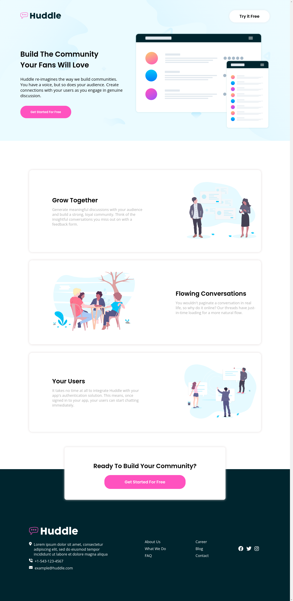

# Frontend Mentor - Huddle landing page with alternating feature blocks solution

This is a solution to the [Huddle landing page with alternating feature blocks challenge on Frontend Mentor](https://www.frontendmentor.io/challenges/huddle-landing-page-with-alternating-feature-blocks-5ca5f5981e82137ec91a5100).

## Table of contents

- [Overview](#overview)
  - [The challenge](#the-challenge)
  - [Screenshot](#screenshot)
  - [Links](#links)
- [My process](#my-process)
  - [Built with](#built-with)
  - [What I learned](#what-i-learned)
  - [Useful resources](#useful-resources)
- [Author](#author)

## Overview

### The challenge

Users should be able to:

- View the optimal layout for the site depending on their device's screen size
- See hover states for all interactive elements on the page

### Screenshot



### Links

- Solution URL: [solution URL](https://www.frontendmentor.io/solutions/huddle-landing-page-with-alternating-feature-blocks-DYBEaJeuKR)
- Live Site URL: [live site URL](https://lollorena.github.io/frontend-mentor-huddle-landing-page-with-alternating-feature-blocks/)

## My process

### Built with

- Semantic HTML5 markup
- Flexbox
- BEM

### What I learned

I've learned CSS architecture (BEM):

```html
  <header class="header">
   <div class="header__image-logo">
    
   </div>

   <nav class="menu">
    <ul>
     <a href="#" class="menu__item">
      <li>Try it Free</li>
     </a>
    </ul>
   </nav>
  </header>
```

### Continued development

I'll continue to improve my CSS skills, especially flexbox, grid and responsive design. And from now on, I'll build websites using BEM.

### Useful resources

- [BEM by Examples](https://sparkbox.com/foundry/bem_by_example) - This resource helped me to apply BEM to my code
- [BEM documentation](https://en.bem.info/methodology/) - It was helpful for me to understand more about blocks/components

## Author

-  Linkedin - [Lorena Facundes](https://www.linkedin.com/in/lorena-f-aa011524a/)
- Frontend Mentor - [@lollorena](https://www.frontendmentor.io/profile/lollorena)